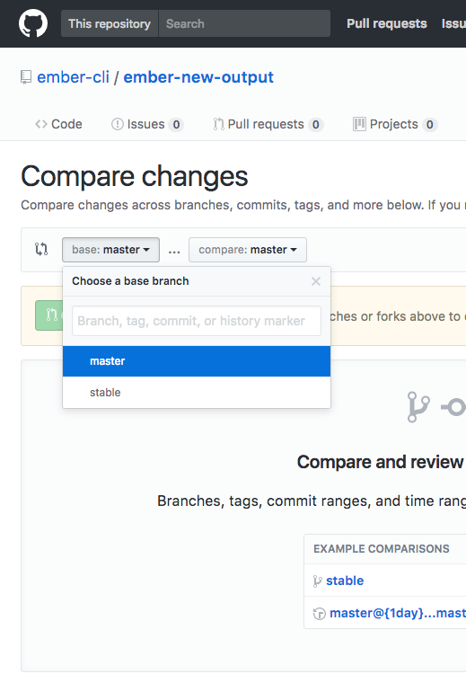
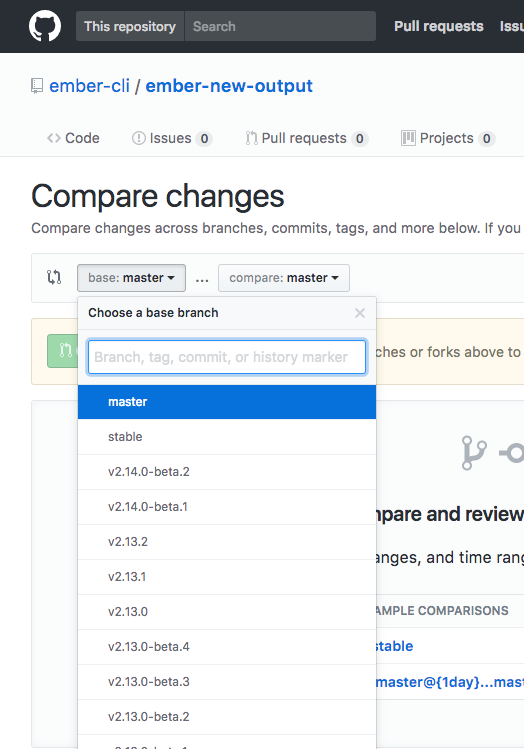

# Github compare tags

Chrome extension that adds tags to the compare page of Github

## Features
* Works out of the box with public repositories
* Enhance the rate limit by adding a token in the options page
* Works with private repositories (repo permission needed)

## Install 

[Chrome extension](https://chrome.google.com/webstore/detail/github-compare-tags/pjkolicadkdcfgjjoopdpleenckeajkk)

Before                     |  After
:-------------------------:|:-------------------------:
      |   

## License

github-compare-tags is licensed under the MIT license.

See [LICENSE](./LICENSE) for the full license text.
